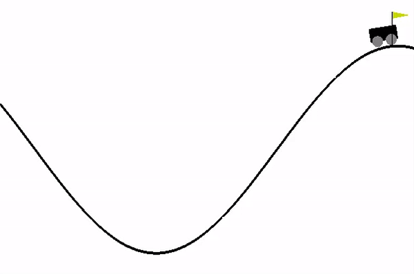

# Mountain Car with Reinforment Learning

The OpenAI Gym library includes a set of Python Reinforcement Learning environments. In this question, we examine the Mountain Car environment of this collection. Mountain Car is a Reinforcement Learning task that aims to learn the policy of climbing a steep hill and reaching the flag-marked goal. Also, the car engine is not powerful enough to climb straight up the hill on the right. Therefore, it must gain enough acceleration by climbing the hill on the left.

The intelligent agent is allowed to perform three movements of right push, no push and left push in each step. The agent's move will be given to the environment and the environment returns the next state along with the movement reward. For each step that the car does not reach the target, a cost of -1 is considered. Use Q-learning to find the optimal policy in each case.

 
